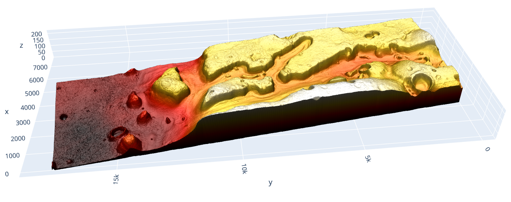

## Planteamiento

En esta actividad del proyecto utilizarás algoritmos de búsqueda para determinar la ruta probable que permitiría a un robot explorador llegar a un objetivo deseado en una superficie con obstáculos.

{fig-align='center' width='500'}

Prueba de algoritmos de búsqueda

Para el mapa de alturas presentado en esta actividad, utilicen al menos tres algoritmos de búsqueda para determinar una posible ruta de navegación desde la posición x = 2850 y = 6400 hasta el punto x = 3150 y = 6800. Entre los algoritmos de búsqueda, debe incluir el método A*. 

Para determinar rutas posibles, consideren lo siguiente:

El Rover explorador puede moverse de un pixel a otro contiguo en el mapa en cualquier dirección, pero sólo si la diferencia de alturas entre la posición actual y la siguiente posición es menor a 0.25 metros (el programa debe manejar este valor como parámetro que pueda ser modificado fácilmente).
Los pixeles del mapa con una altura de -1 no son válidos y el Rover no se puede mover hacia ellos.

## Fase 1: Importaciones
```{python}
## Fase 1: Importaciones
import math
import time
import heapq
from collections import deque
from dataclasses import dataclass
from typing import Callable, Dict, List, Tuple
import numpy as np
import itertools
import matplotlib.pyplot as plt

# Procesamiento del mapa
mars_map = np.load('/Users/juanfelipezepeda/Documents/TEC/python/mars_map.npy')
nr, nc = mars_map.shape

# Transformación de coordenadas

print('Número de filas:')
print(nr, nc)

escala = 10.0174

def coords_to_rows(x, y):
  r = int(nr - round(y / escala))
  c = int(round(x / escala))
  return r, c

def rows_to_coords(r, c):
  x = c * escala
  y = (nr - r) * escala
  return x, y

test_x = 1000
test_y = 2000
print('\nCoordenadas de prueba:')
print(coords_to_rows(test_y, test_x))

x_i = 2850 
y_i = 6400 
print('Coordenadas iniciales:')
print(coords_to_rows(y_i, x_i))

x_f = 3150
y_f = 6800
print('\nCoordenadas finales:')
print(coords_to_rows(y_f, x_f))
```

## Fase II: Constraits
```{python}
## Fase II: Constraits
MAX_HEIGHT_DIFF = 0.25
SCALE_M_PER_PX = 10.0174
INVALID_H = -1.0
HMAP = mars_map

START_X = 2850 
START_Y = 6400

END_X = 3150
END_Y = 6800

# Initial Matrix states

filas = nr
columnas = nc
valor_predeterminado = None

# Crear matriz reached en false
reached = [[valor_predeterminado for _ in range(columnas)] for _ in range(filas)]
# Crear matriz frontier en false
frontier = [[valor_predeterminado for _ in range(columnas)] for _ in range(filas)]
# Crear matriz path en false
path = [[valor_predeterminado for _ in range(columnas)] for _ in range(filas)]

# Clases

@dataclass(frozen=True)
class Node:
  row: int
  col: int
  height: float 
  heur: float
  cost: float = 0.0
  prev: 'Node' = None

  def expanded(self):
    reached[self.row][self.col] = self
    frontier[self.row][self.col] = None


@dataclass
class SearchResult:
    found: bool
    path: List[Node]
    explored_nodes: List[Node]
    distance_m: float
    expanded: int
    time_s: float

def calcHeur(r, c, tx = END_X, ty = END_Y):
  x, y = rows_to_coords(r,c)
  delta_x = math.fabs(x - tx)
  delta_y = math.fabs(y - ty)
  dist_euc = math.sqrt(delta_x**2 + delta_y**2)
  return dist_euc

## INITIAL STATES

def buildInitNode():
  r, c = coords_to_rows(START_X, START_Y)
  h = HMAP[r,c]
  heur = calcHeur(r, c)
  return Node(r, c, h, heur)
```

## Fase III: Funciones operativas
```{python}
## Fase III: Funciones operativas
NEIGHBORS_8 = [
    (-1,  0, 1.0), (1,  0, 1.0), (0, -1, 1.0), (0, 1, 1.0),
    (-1, -1, math.sqrt(2)), (-1, 1, math.sqrt(2)),
    ( 1, -1, math.sqrt(2)), ( 1, 1, math.sqrt(2)),
]

def isValidNeighbour(curr_nodo: Node, new_nodo: Node, step_cost: float):
  # Validación básica de altura
  if new_nodo.height is None or new_nodo.height <= INVALID_H:
    return False

  # Regla de la actividad: diferencia de alturas menor a 0.25 m.
  height_diff = math.fabs(new_nodo.height - curr_nodo.height)
  if height_diff >= MAX_HEIGHT_DIFF:
    return False

  return True

def getNeigbors(nodo: Node):
  neighbors: List[Node] = []

  for dr, dc, step_cost in NEIGHBORS_8:
    r = nodo.row + dr
    c = nodo.col + dc

    # Evitar IndexError (límites del mapa)
    if r < 0 or r >= nr or c < 0 or c >= nc:
      continue

    h = float(HMAP[r, c])
    g = nodo.cost + step_cost
    heur = calcHeur(r, c)

    nn = Node(r, c, h, heur, g, nodo)

    if isValidNeighbour(nodo, nn, step_cost):
      neighbors.append(nn)

  return neighbors


def step_length_px(a: Node, b: Node):
  dr = abs(a.row - b.row)
  dc = abs(a.col - b.col)
  return math.sqrt(2) if dr == 1 and dc == 1 else 1.0


def edge_height_diff(a: Node, b: Node):
  return math.fabs(b.height - a.height)
    
  
def expandirNodo(nodo: Node):
  nodo.expanded()
  neigbors: [Node] = getNeigbors(nodo)
  for n in neigbors:
    frontier[n.row][n.col] = 1
  return(len(neigbors))
```

```{python}
START_NODE = buildInitNode()
START_NODE.expanded()

print(expandirNodo(START_NODE))
```

```{python}
print('Rows:', nr, nc)
START_R, START_C = coords_to_rows(START_X, START_Y)
END_R, END_C     = coords_to_rows(END_X, END_Y)

print('\nCoordenadas del inicio:' , START_X, START_Y) 
print('Filas del inicio:' , START_R, START_C)
print('\nCoordenadas del objetivo:' , END_X, END_Y) 
print('Filas del objetivo:' , END_R, END_C)

plt.figure(figsize=(8, 6))
reached_mask = np.array([[cell is not None for cell in row] for row in reached])
plt.imshow(np.ma.masked_where(~reached_mask, mars_map), cmap='viridis', alpha=0.6)
plt.imshow(mars_map, cmap='gray', interpolation='none')  # origin='upper' por default
plt.scatter(END_C, END_R, color='red', s=50)
plt.scatter(START_C, START_R, color='lime', s=50)
plt.show()
```

## Fase IV: Algoritmos de búsqueda
```{python}
def reset_search_state():
  global reached, frontier, path
  reached = [[None for _ in range(columnas)] for _ in range(filas)]
  frontier = [[None for _ in range(columnas)] for _ in range(filas)]
  path = [[None for _ in range(columnas)] for _ in range(filas)]


def target_row_col():
  return coords_to_rows(END_X, END_Y)


def is_goal(node: Node, goal_rc: Tuple[int, int]):
  return node.row == goal_rc[0] and node.col == goal_rc[1]


def reconstruct_path(goal_node: Node):
  route = []
  curr = goal_node
  while curr is not None:
    route.append(curr)
    path[curr.row][curr.col] = curr
    curr = curr.prev
  route.reverse()
  return route


def explored_nodes_from_state():
  nodes = []
  for r in range(filas):
    for c in range(columnas):
      if reached[r][c] is not None:
        nodes.append(reached[r][c])
  return nodes


def path_length_m(route: List[Node]):
  if len(route) < 2:
    return 0.0
  total_px = 0.0
  for a, b in zip(route, route[1:]):
    dr = abs(a.row - b.row)
    dc = abs(a.col - b.col)
    total_px += math.sqrt(2) if dr == 1 and dc == 1 else 1.0
  return total_px * SCALE_M_PER_PX


def path_stats(route: List[Node]):
  if len(route) < 2:
    return {'steps': 0, 'turns': 0, 'diag_steps': 0, 'axis_steps': 0, 'max_height_diff': 0.0}

  turns = 0
  diag_steps = 0
  axis_steps = 0
  max_height_diff = 0.0
  prev_dir = None

  for a, b in zip(route, route[1:]):
    dr = b.row - a.row
    dc = b.col - a.col
    move = (dr, dc)
    if prev_dir is not None and move != prev_dir:
      turns += 1
    prev_dir = move

    step_px = math.sqrt(2) if abs(dr) == 1 and abs(dc) == 1 else 1.0
    if step_px > 1.0:
      diag_steps += 1
    else:
      axis_steps += 1

    dh = edge_height_diff(a, b)
    max_height_diff = max(max_height_diff, dh)

  return {
      'steps': len(route) - 1,
      'turns': turns,
      'diag_steps': diag_steps,
      'axis_steps': axis_steps,
      'max_height_diff': max_height_diff
  }


def build_result(found: bool, goal_node: Node, expanded: int, t0: float):
  route = reconstruct_path(goal_node) if found else []
  explored = explored_nodes_from_state()
  dist_m = path_length_m(route) if found else 0.0
  return SearchResult(
      found=found,
      path=route,
      explored_nodes=explored,
      distance_m=dist_m,
      expanded=expanded,
      time_s=time.perf_counter() - t0
  )


def plot_search_result(result: SearchResult, title: str):
  if not result.path:
    print(f'{title}: no hay ruta para graficar.')
    return

  explored_mask = np.zeros((nr, nc), dtype=bool)
  for n in result.explored_nodes:
    explored_mask[n.row, n.col] = True

  rows = np.array([n.row for n in result.path])
  cols = np.array([n.col for n in result.path])

  START_R, START_C = coords_to_rows(START_X, START_Y)
  END_R, END_C = coords_to_rows(END_X, END_Y)

  print(f'{title}: píxeles reached = {int(explored_mask.sum())}')

  plt.figure(figsize=(8, 3))
  plt.imshow(mars_map, cmap='gray', interpolation='none')
  plt.imshow(np.ma.masked_where(~explored_mask, explored_mask), cmap='Purples', alpha=0.60, interpolation='none')
  plt.plot(cols, rows, color='yellow', linewidth=1.5, label='Ruta')
  plt.scatter(START_C, START_R, color='lime', s=50, label='Inicio')
  plt.scatter(END_C, END_R, color='red', s=50, label='Objetivo')
  plt.title(f'{title} (vista global)')
  plt.legend(loc='upper right')
  plt.show()


def plot_three_results(results: List[Tuple[str, SearchResult]]):
  fig, axes = plt.subplots(1, 3, figsize=(7, 5))
  START_R, START_C = coords_to_rows(START_X, START_Y)
  END_R, END_C = coords_to_rows(END_X, END_Y)

  for ax, (title, result) in zip(axes, results):
    explored_mask = np.zeros((nr, nc), dtype=bool)
    for n in result.explored_nodes:
      explored_mask[n.row, n.col] = True

    ax.imshow(mars_map, cmap='gray', interpolation='none')
    ax.imshow(np.ma.masked_where(~explored_mask, explored_mask), cmap='viridis', interpolation='none')

    if result.path:
      rows = np.array([n.row for n in result.path])
      cols = np.array([n.col for n in result.path])
      ax.plot(cols, rows, color='yellow', linewidth=1.2)

    ax.scatter(START_C, START_R, color='lime', s=35)
    ax.scatter(END_C, END_R, color='red', s=35)
    ax.set_title(title)
    ax.set_xticks([])
    ax.set_yticks([])

  plt.tight_layout()
  plt.show()
```

```{python}
def bfs_search():
  reset_search_state()
  t0 = time.perf_counter()
  goal_rc = target_row_col()

  start = buildInitNode()
  start = Node(start.row, start.col, start.height, start.heur, 0.0, None)

  q = deque([start])
  frontier[start.row][start.col] = start
  expanded = 0

  while q:
    curr = q.popleft()
    if reached[curr.row][curr.col] is not None:
      continue

    curr.expanded()
    expanded += 1

    if is_goal(curr, goal_rc):
      return build_result(True, curr, expanded, t0)

    for nn in getNeigbors(curr):
      if reached[nn.row][nn.col] is not None:
        continue
      if frontier[nn.row][nn.col] is not None:
        continue

      # BFS: cada movimiento cuenta como 1 paso.
      child = Node(nn.row, nn.col, nn.height, nn.heur, curr.cost + 1.0, curr)
      frontier[child.row][child.col] = child
      q.append(child)

  return build_result(False, None, expanded, t0)
```

```{python}
def dijkstra_search():
  reset_search_state()
  t0 = time.perf_counter()
  goal_rc = target_row_col()

  start = buildInitNode()
  start = Node(start.row, start.col, start.height, start.heur, 0.0, None)

  dist = [[math.inf for _ in range(columnas)] for _ in range(filas)]
  dist[start.row][start.col] = 0.0

  pq = []
  push_id = itertools.count()
  heapq.heappush(pq, (0.0, next(push_id), start))
  frontier[start.row][start.col] = start
  expanded = 0

  while pq:
    g_curr, _, curr = heapq.heappop(pq)
    if g_curr > dist[curr.row][curr.col]:
      continue
    if reached[curr.row][curr.col] is not None:
      continue

    curr.expanded()
    expanded += 1

    if is_goal(curr, goal_rc):
      return build_result(True, curr, expanded, t0)

    for nn in getNeigbors(curr):
      nr_, nc_ = nn.row, nn.col
      g_new = nn.cost

      if g_new < dist[nr_][nc_]:
        dist[nr_][nc_] = g_new
        better = Node(nr_, nc_, nn.height, nn.heur, g_new, curr)
        frontier[nr_][nc_] = better
        heapq.heappush(pq, (g_new, next(push_id), better))

  return build_result(False, None, expanded, t0)
```

```{python}
def astar_search():
  reset_search_state()
  t0 = time.perf_counter()
  goal_rc = target_row_col()

  start = buildInitNode()
  start = Node(start.row, start.col, start.height, start.heur, 0.0, None)

  g_score = [[math.inf for _ in range(columnas)] for _ in range(filas)]
  g_score[start.row][start.col] = 0.0

  pq = []
  push_id = itertools.count()
  heapq.heappush(pq, (start.heur, next(push_id), start))
  frontier[start.row][start.col] = start
  expanded = 0

  while pq:
    _, _, curr = heapq.heappop(pq)

    if reached[curr.row][curr.col] is not None:
      continue

    curr.expanded()
    expanded += 1

    if is_goal(curr, goal_rc):
      return build_result(True, curr, expanded, t0)

    for nn in getNeigbors(curr):
      nr_, nc_ = nn.row, nn.col
      g_new = nn.cost

      if g_new < g_score[nr_][nc_]:
        g_score[nr_][nc_] = g_new
        better = Node(nr_, nc_, nn.height, nn.heur, g_new, curr)
        frontier[nr_][nc_] = better
        f_new = g_new + better.heur
        heapq.heappush(pq, (f_new, next(push_id), better))

  return build_result(False, None, expanded, t0)
```

## Fase V: Ejecución y comparación
```{python}
res_bfs = bfs_search()
res_dij = dijkstra_search()
res_ast = astar_search()

print('BFS:')
print(f'  Encontrado: {res_bfs.found}')
print(f'  Nodos expandidos: {res_bfs.expanded}')
print(f'  Distancia estimada [m]: {res_bfs.distance_m:.2f}')
print(f'  Tiempo [s]: {res_bfs.time_s:.4f}')
if res_bfs.found:
  stats = path_stats(res_bfs.path)
  print(f'  Pasos: {stats["steps"]}, giros: {stats["turns"]}, diagonales: {stats["diag_steps"]}, rectos: {stats["axis_steps"]}, Δaltura máx: {stats["max_height_diff"]:.4f} m')

print('\nDijkstra:')
print(f'  Encontrado: {res_dij.found}')
print(f'  Nodos expandidos: {res_dij.expanded}')
print(f'  Distancia estimada [m]: {res_dij.distance_m:.2f}')
print(f'  Tiempo [s]: {res_dij.time_s:.4f}')
if res_dij.found:
  stats = path_stats(res_dij.path)
  print(f'  Pasos: {stats["steps"]}, giros: {stats["turns"]}, diagonales: {stats["diag_steps"]}, rectos: {stats["axis_steps"]}, Δaltura máx: {stats["max_height_diff"]:.4f} m')

print('\nA*:')
print(f'  Encontrado: {res_ast.found}')
print(f'  Nodos expandidos: {res_ast.expanded}')
print(f'  Distancia estimada [m]: {res_ast.distance_m:.2f}')
print(f'  Tiempo [s]: {res_ast.time_s:.4f}')
if res_ast.found:
  stats = path_stats(res_ast.path)
  print(f'  Pasos: {stats["steps"]}, giros: {stats["turns"]}, diagonales: {stats["diag_steps"]}, rectos: {stats["axis_steps"]}, Δaltura máx: {stats["max_height_diff"]:.4f} m')

plot_three_results([
  ('BFS', res_bfs),
  ('Dijkstra', res_dij),
  ('A*', res_ast),
])
```
